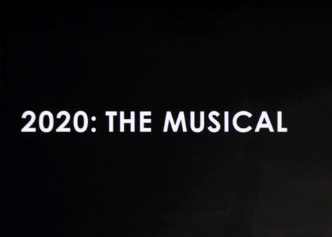
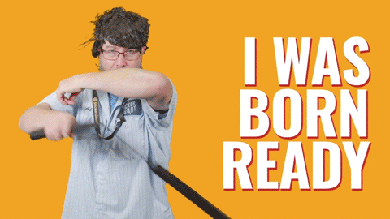

  
Soliloquy about the last two crazy years<em>(professionally)</em>.

  <h2 class="mt-5">Ending 2020</h2>
  

    With all the crazy things that were happening in 2020, I, like most other people around me, was feeling hopeless 
		about finding an internship and was getting rather anxious to put my acquired skillset to test and to learn new things. 
		As a last ditch effort, I applied to a UI Developer co-op position at Addgene. I did not have a lot of hopes of a positive response, 
		because it had been more than two months that the position was open at the time and was quite sure that the position must have been filled. 
		I was rather surprised to get a call for an interview. Few interviews later, received an offer for an 8 month long internship. 
		And thus a grim, crazy, hopeless 2020 came to a relatively happier end for me and gave me something to look forward to in 2021.
    
    Even though it felt like forever, 2020 ended on a good note for me 
		<a href="https://giphy.com/gifs/fallontonight-jimmy-fallon-tonight-show-2020-the-musical-u4c3r198JFGkc8Xewn" class="text-reset">via GIPHY</a>
  

  <h2 class="my-5">2021 and Addgene</h2>
  

    Never been so enthusiastic about starting a new year as an adult as I was in the year 2021, but my mind was the 
		most horrible sundae made up of anxiety, nervousness, excitement sprinkled with tiny chunks of self-doubt. 
		With the only thought of giving my best I started my journey with <a href="https://www.addgene.org" target="_blank" rel="noopener noreferrer">Addgene</a>, the world's largest non-profit repository of scientific materials like plasmids, viruses, and quite 
		recently antibodies. Soon after I started, I realized there was a great satisfaction in working at Addgene, 
		a highly mission driven group of people who want to make a difference in the world, a mission of open science! 
		Had the best mentor+lead anyone could only dream of. With every ticket that I successfully completed, there was 
		a great boost in my confidence and technical skills as if increase in XP. With a great capstone project that helped 
		the Content team easily publish video content with the least efforts, using DjangoCMS plugins, 
		I was fortunate enough to get my feet wet with design <em>and</em> implementation.
  

  

    The co-op at Addgene was the highlight of my year and I realized that all the anxiety and self doubt
		I had at the beginning, were a great drivers in my approach to work, I tried to stay ahead of everything 
		that I was doing and it certainly paid off because I got offered a full time opportunity with Addgene. 
		This not only made me jump up and down my bed for almost 5 minutes and punching air, but it also taught me
		a valuable lesson that actions build confidence, and what doesn't kill you does make you smarter.
		<em>(I know Nietzsche said stronger, but I'd rather be smarter than stronger)</em>
  

  <h3 class="my-5">Onewheel: A toy everyone should try</h3>
  
It would be remiss of me, to not mention the Onewheel that I bought and spent most of my summer and fall of 2021, 
	I did not know I was in bad state mentally and psychologically until I was out of it. Working at an awesome place, 
	doing what I loved the most and getting this fantastic toy certainly brought me real joy that I didn't know was missing in my life, last several years.
    
    It was indeed a surreal 2021 <a href="https://giphy.com/gifs/onewheel-rideonewheel-thefloatlife-fsnElTLTbow6WsbFT1">via GIPHY</a>
  

  <h2 class="my-5">2022, a bit of Improv and cool new projects at work</h2>
  

    I was equally excited to join Addgene back as a UX Engineer as I was last year, 
		because I had a brief idea of what cool projects we have in store for 2022, the first one was Antibody Applications.

  <ul>
    <li>The UX was ready. We had a brand new pattern to show the association between the applications with the antibody material.</li>
    <li>All the models in the backend were set up reflecting the relationship between the the antibody material and it's application</li>
    <li>I was eager to get my hands dirty with coding the views and templates to match the design.</li>
  </ul>
  So there I was working on something completely new, challenging yet I knew it was going to be highly rewarding to get it done, 
	with the help from a sage developer, we were able to make it to the slated launch date. 
	And then it was time to move on to the perhaps the next and biggest adventure Data Hub.
  <ul>
    <li>Addgene's <a href="datahub.addgene.org" rel="noopener">Data Hub</a> is place for scientists to share the findings of 
		their experiments(failed or successful) with the rest of the research community. 
		Because of the nature of AAV experiments, there is a very high value in knowing the details of the experiments, 
		to be able to reproduce them and compare findings.</li>
    <li>It was a beta project that kicked off in 2019, and it was time for us to move onto the next iteration, i.e. to make it it's own proper application.</li>
    <li>The application developers and the tech liasons decided this was a good application to use ReactJS.</li>
    <li>Me, having had a very little experience with ReactJS and me being mainly responsible for a lot of frontend. I had to learn React to be able to create UX that matched the high fidelity designs.</li>
    
    When asked if I was ready to tackle this new challenge, all I did was this ^ <a href="https://giphy.com/gifs/stickergiant-sticker-giant-born-ready-i-was-9LY2JzWiUHPvqx18Yo">via GIPHY</a>
    <li>Albeit being a rollercoaster ride of the learning curve, we all successfully met the launch deadline with the 
		feature ready to be showcased at the Neuro-Science Conference</li>
  </ul>
  <h3 class="my-5">Improv, a new unlock!</h3>
  
While I am good at the technical aspects of the world I wanted to get good at speaking, my work rarely involves a lot of speaking,
	 since we mainly work remotely, most of the communication happens through messages.
	  In order to get some speaking experience, I stumbled onto <a href="https://jpimprov.net/" rel="noopener">JP Improv</a> and Myles,
		a superb teacher and the creator of JP Improv, and took a 101 workshop with him to learn what improv was all about. Met a group of funny people and had the most fun improvising, even got good feedback that I got pretty good at improv.

	<blockquote class="blockquote text-right mt-5">
		
It's easy to get caught up in the things that we couldn't do, because of our innate negativity bias

		<footer class="blockquote-footer">Surely a professor said this <cite title="Source Title">during his psychology class</cite></footer>
	</blockquote>
	
For example, I didn't travel enough, didn't make enough 
	progress in my guitar journey, instead I thought it is better to appreciate what I did and it has personally been a crazy year for me, hope the next year is even crazier.
	But I -

	<ul>
		<li>Hit personal best on most of the lifts at the gym, and this would be the best year for me considering I exercised nearly 8 months quite regularly.</li>
		<li>Did not fall sick, definitely a sign of being in a better shape</li>
		<li>Managed to write a journal for almost 2 months to make note of all the new things I was learning at work and otherwise.</li> 
	</ul>
	These are all pretty good achievements considering it was a hectic year at work(not just for me, I think, for a lot of folks I was working alongside).
	
	
Wish you all a very happy new 2023, keep at it, my friends! :tiger:

